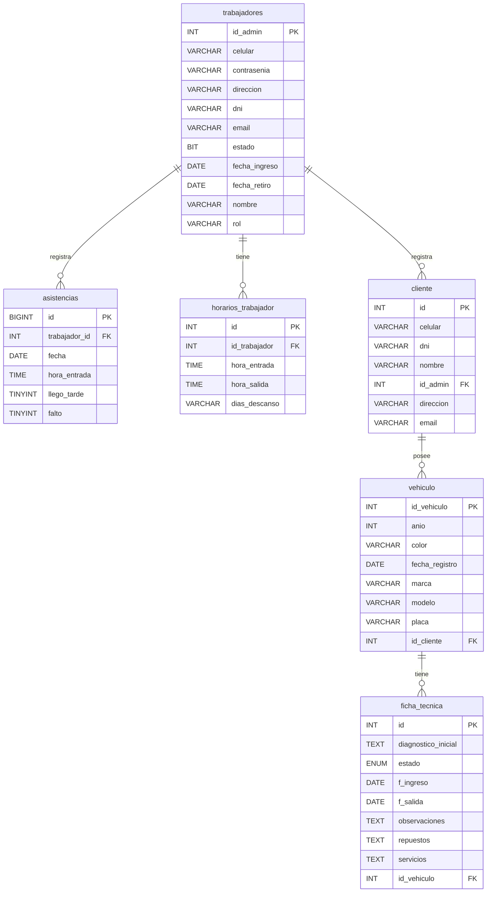

# Automotriz Backend


Sistema de gestión integral para talleres automotrices que permite administrar clientes, vehículos, trabajadores, asistencias y fichas técnicas. API REST desarrollada con Spring Boot que proporciona endpoints seguros y eficientes para todas las operaciones del negocio.

> **Nota:** Este repositorio contiene el código fuente del Backend.
>
> **Frontend Repository:** Puedes encontrar el código del frontend en: [SAF Service Frontend](https://github.com/Shiro-Vs/Automotriz.git)

## 📋 Requisitos Previos

- Java 21
- Maven 3.6+
- MySQL 8.0+
- Git

## 🚀 Configuración del Proyecto

### 1. Clonar el Repositorio

```bash
git clone https://github.com/Shiro-Vs/AutomotrizBackend.git
cd AutomotrizBackend
```

### 2. Configurar la Base de Datos

Crea una base de datos MySQL con el nombre que prefieras:

```sql
CREATE DATABASE automotrizbd;
```

### 3. Configurar Credenciales

Edita el archivo `src/main/resources/application.properties`:

```properties
# Configuración de la base de datos
spring.datasource.url=jdbc:mysql://localhost:3306/TU_NOMBRE_BD
spring.datasource.username=TU_USUARIO
spring.datasource.password=TU_CONTRASEÑA
```

**Reemplaza:**

- `TU_NOMBRE_BD` con el nombre de tu base de datos
- `TU_USUARIO` con tu usuario de MySQL
- `TU_CONTRASEÑA` con tu contraseña de MySQL

### 4. Configurar CORS para el Frontend

En el archivo `src/main/java/com/automotriz/backend/SecurityConfig.java`, actualiza la URL del frontend:

```java
config.setAllowedOrigins(List.of(
    "http://localhost:5173",  // URL donde corre tu frontend
    "http://127.0.0.1:5173"
));
```

**Frontend del proyecto:** [SAF Service Frontend](https://github.com/Shiro-Vs/Automotriz.git)

## 🏃‍♂️ Ejecutar el Proyecto

### Opción 1: Usando Maven Wrapper (Recomendado)

```bash
./mvnw spring-boot:run
```

En Windows:

```bash
mvnw.cmd spring-boot:run
```

### Opción 2: Usando Maven

```bash
mvn spring-boot:run
```

El servidor estará disponible en: `http://localhost:8081`

## 📦 Compilar el Proyecto

```bash
./mvnw clean install
```

## 🛠️ Tecnologías Utilizadas

- **Spring Boot 3.3.0**
- **Spring Security**
- **Spring Data JPA**
- **MySQL**
- **Lombok**
- **Jackson (JSR310)**

## 📁 Estructura del Proyecto

```
src/main/java/com/automotriz/backend/
├── controller/      # Controladores REST
├── service/         # Lógica de negocio
├── repository/      # Acceso a datos
├── model/           # Entidades JPA
├── dto/             # Objetos de transferencia de datos
└── SecurityConfig.java
```
## 🗄️ Modelo de Datos (ER Diagram)

A continuación se muestra el diagrama Entidad-Relación que representa la estructura de la base de datos del sistema:



    
## 🔌 Endpoints Principales

- `/api/clientes` - Gestión de clientes
- `/api/vehiculos` - Gestión de vehículos
- `/api/trabajadores` - Gestión de trabajadores
- `/api/asistencias` - Control de asistencias
- `/api/horarios` - Gestión de horarios
- `/api/fichas-tecnicas` - Fichas técnicas de vehículos

## ⚙️ Configuración Adicional

### Puerto del Servidor

Por defecto, el servidor corre en el puerto `8081`. Para cambiarlo, edita `application.properties`:

```properties
server.port=TU_PUERTO
```

### Modo de Hibernate

El proyecto está configurado con `spring.jpa.hibernate.ddl-auto=none`. Si necesitas que Hibernate cree las tablas automáticamente, cámbialo a:

```properties
spring.jpa.hibernate.ddl-auto=update
```

## 📝 Acerca del Proyecto

Este proyecto fue desarrollado como parte de un trabajo universitario, implementando estándares profesionales de desarrollo web.

**Desarrollado por:** [Shiro-Vs](https://github.com/Shiro-Vs)

**Repositorios:**

- Backend: https://github.com/Shiro-Vs/AutomotrizBackend.git
- Frontend: https://github.com/Shiro-Vs/Automotriz.git
